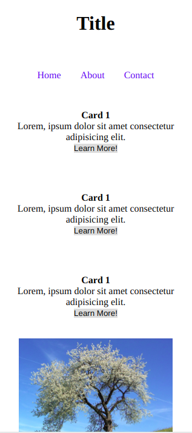
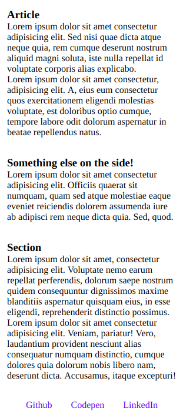
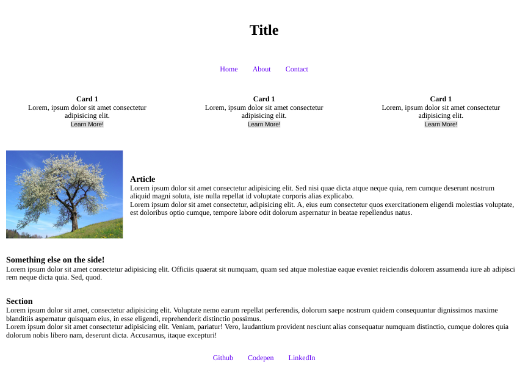

# SCSS Variables - Exercise 2

## Task 1

Adapt the given CSS stylesheet and position the elements as seen in the pictures below.

Add padding, margins etc where needed.

Make it responsive. Design for mobile first and then desktop. Breakpoint: 600px.

Tipp: Limit the size of the image first, because it is pretty big. It should not be able to exceed its container.

## Task 2

Style the buttons in the cards.

Restyle the two lists at the top and the bottom. Let the list items flow next to each other. Which kind of justify to choose for the list items? Look how the list items should look on the desktop version.

### Result mobile (< 600px)

&nbsp;

### Result desktop (>= 600px)

## Task 3 - Switch from CSS to SCSS

- Backup / Copy your style.css to style-original.css (to keep it as a reference)
- Rename your style.css file to style.scss
- Within style.scss
  - Create variables for 2 different colors (background or text or both)
  - Create variables for 3 different font sizes (e.g. one for headings, paragraph & button)
  - Apply all variables throughout your stylesheet
- Convert the style.scss to style.css by using the Sass command in the terminal
  - Apply the --watch flag so it will constantly include all your changes

Now change a variable - e.g. a heading color - and test if the styles are adapted throughout the page.

Good luck!
